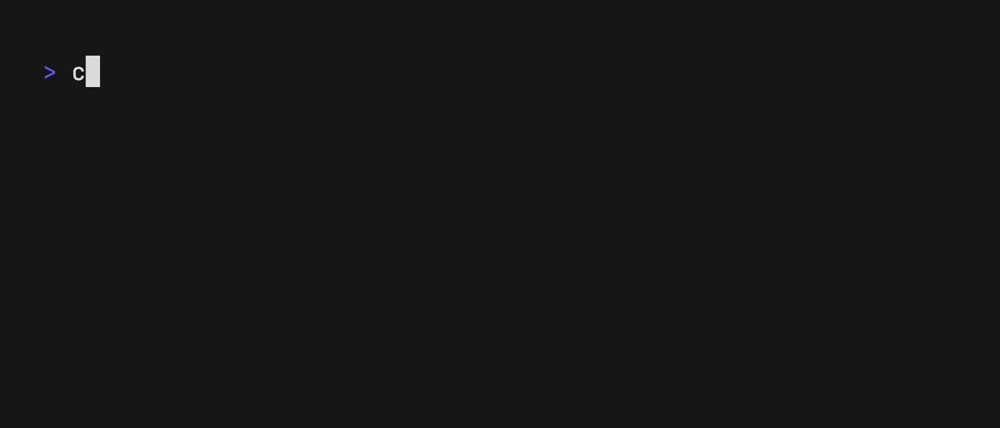

# Culprit

Culprit is a command line tool that helps you delete common and known files that fill up your Mac's storage. It is simple, extendable, open, and secure.

> [!IMPORTANT]
> Culprit is currently in early development, so expect bugs and breaking changes. It also has very few built-in recipes at the moment, but I will be adding more soon and contributions are very welcome!



Features:
- **Culprit will never actually delete files**, it generates a bash script with `rm` calls that you can review and run yourself
- **Highly extendable**, define rules with [recipes](#recipes)
- **Comes with a set of built-in recipes** for common apps and file types
- **Recipes are smart**, they can use advanced conditions like only deleting certain files if the app is not installed, or only deleting files older than a certain date
- **Ship recipes with your app** to help users clean up files related to your app
- **Open source**, contribute your own recipes and improvements to the project!

## Installation

As culprit is currently in early development, there are no pre-built binaries available.

You can build it yourself:

```bash
git clone https://github.com/floffah/culprit.git
cd culprit
go build -o culprit cmds/culprit/culprit.go
mv culprit /usr/local/bin/culprit
```

OR install it with go

```bash
go install github.com/floffah/culprit/cmds/culprit@latest
```

## Usage

Everything is done with `culprit clean [type]`.

Current types are:
- `soft`: deletes common files that are generally safe to delete, such as caches and logs
- `hard`: deletes more files that may be less safe to delete, such as app support files that are no longer needed and old downloads

```bash
$ culprit clean --help
Evaluate all recipes and creates a shell script to clean up derived files

Usage:
  culprit clean [type] [flags]

Flags:
      --force           Overwrite the output file if it already exists
  -h, --help            help for clean
      --no-sizes        Skip calculating clearable sizes while generating the cleanup script (can speed up generation significantly)
  -o, --output string   The output file to write the cleanup script to (default "cleanup.sh")

Global Flags:
      --no-tty    Disable TTY features like spinners and progress bars
      --verbose   Enable verbose theming
```

## Recipes

Recipes are define in TOML files and live in the recipes directory (default `~/.culprit/recipes`). You can add your own recipes here, or contribute them to the project! The recipe dir is configurable by editing `~/.culprit/culprit.toml` or with the `CULPRIT_RECIPES` environment variable.

Built in recipes are not stored in the recipe dir but are embedded in the binary, but they can be overridden by adding a recipe with the same name to the recipe dir.

Recipes have a few required fields:
- `name`: the name of the recipe, used for logging and debugging
- `type`: the type of the recipe, either `soft` or `hard`
- `description`: a description of the recipe, used for logging and debugging

Recipes then have three collections: inputs, targets and conditions.

Inputs collect values that targets and conditions can reference. The first supported input type is `path`:

```toml
[[inputs]]
id = "project_path"
kind = "path"
prompt = "Project path"
default = "~/Developer/my-project"
placeholder = "~/Developer/my-project"

[[targets]]
reason = "Remove this project's local cache."
kind = "absolute"
path = "{{ .Inputs.project_path }}/.cache"
```

Input references use Go `text/template` syntax. Inputs are available on `.Inputs`, so an input with `id = "project_path"` is referenced as `{{ .Inputs.project_path }}`. Path input values expand environment variables and a leading `~`.

Input IDs are scoped to the recipe. To share one answer across recipes, use `global_id`:

```toml
[[inputs]]
id = "workspace"
kind = "path"
global_id = "projects_path"
prompt = "Where do you keep your projects?"
```

Presets can populate common input fields, including `kind`, `prompt`, `default`, and `global_id`:

```toml
[[inputs]]
id = "workspace"
preset = "projects_path"
```

Targets still reference the recipe-scoped `id`:

```toml
path = "{{ .Inputs.workspace }}/culprit/.cache"
```

Command templates should shell-quote path-like inputs explicitly:

```toml
command = "tool clean {{ shellquote .Inputs.project_path }}"
```

Targets define the files that will be deleted if the recipe is run. You can view [the types file](./internal/recipe/types.go) for the full list of target types, eventually I will document them here.

Conditions define the conditions that must be met for the recipe to be run. You can view [the types file](./internal/recipe/types.go) for the full list of condition types, eventually I will document them here.
